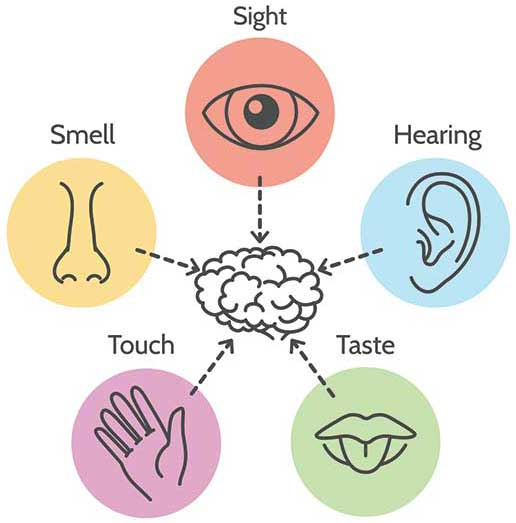

Paragraph about complexity

- #### Complex ingredients
Its not just about taste though. Skilled cooks make the most of their ingredients and use not only their flavor, but also their texture and visual aspect. When eating a meal, almost all of your sensory canals are used. If even one aspect of a dish is of poor quality, the whole experience is ruined.

Again, its the same thing in video games. To create an enjoyable experience you mustn't just design the rules of a game. You also have to design all its music, art, and story. And you know what? Each of these things also have surprising combinations in them. As you can guess, it's very hard to master all these things at the same time, which is why there's a lot of different specialists in a game development team.

OTHER NOTES:

The skill to make plants grow is essential for the ability to even be able to cook.

growing the ingredients

behave like plants
start with an initial seed (have the same name)
that you take care of, following a procedure like having a certain amount of luminosity, watering it with at a specific pace.

Write it on a list.

More importantly: trial and error. There will be a lot of dead plants at the beginning. But as you try things out, you start to get a sense of what works, and what doesn't.

algorithm

planting strawberry seeds

#### we could go further

powerful analogy
care about the process, the context not just the end result
-- Infinite Rembrant, Infinite Oatmeal

processed food and triple AAA
but discussions for another time.
follow us
here, on strawberry seed !
((next time, I'll tell you why I chose strawberries
