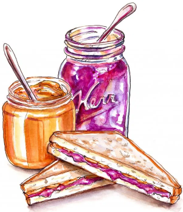

## My Jam? Planting Strawberry Seeds.

> You take a seat at the table. Everything looks delicious, you can't wait to dive in. Your aunt passes you the salad. "*How is it going at school? Isn't it lonely to be all by yourself?*", she asks. Your eyes still on your plate, your tongue moves by itself. "*It's going fine! I got my diploma last semester*". Small silence. She's still processing. You know where this is going.
"*Oh, very good! I didn't know that. So what are you doing now? Job hunting?*". You still have a couple of seconds, quick find an expl-"*Actually, I've started a PhD!*". Oh no. You went too fast. It's coming any second now. Brace yourself.
>
>
>"*Excellent! What's your research subject about?*".
>
> You take a deep breath. Here we go.

Ever since high school, I've always found it pretty difficult to explain what I'm currently studying, be it with friends or family. Now that I've started a PhD at **[IGGI](https://iggi.org.uk/)** (UK), its starting to get trickier. My research subject is about how to "*Generate Coherent and Meaningful New Playable Characters*". Its a very specific topic, at the crossroads of procedural generation, game design, and AI.

If I wanted to explain that to my kind but over-protective aunt, I would need to start by:
1. evidencing that playing games is actually a good thing,
1. that there are people who are trying to make them even better and
1. that we can use computers as creative tools.

Yeah. Not so easy.

But being able to communicate your work to a wide audience is a crucial skill for a researcher. After all, what good can we do to the world, if nobody understands what we're doing? That's why I'm starting this little blog: I want to be able to share all the exciting stuff I'm working on with everyone who'd like to hear a little more about games. How we make them, what they mean to us, and especially, **how games can pleasantly surprise us**.

Going back to that intro story, I believe I finally can  explain the core ideas behind my research in a way that is accessible, even for my gameoskeptic aunt. The answer was right under my nose, on the table.

### 1.  Playing is Eating

At their core, playing and eating are the same thing. Hey, think about it. Everyone has their own favorite dishes, and also their favorite game genres. We consume both food and games as a way to comfort ourselves, to relieve stress or just to have a good time.

When you look closely, a Ramadan family dinner or a Dungeon & Dragons afternoon are both excuses to create a context where we can have fulfilling social relationships.

In the end, whether it is by playing or  by eating, you're consuming **a good that someone had made with work and care**. They spent time to create an experience, hoping you'll love its taste. How did they do that?

### 2.  Game Design is Cooking

Making meals and making games are both crafts that requires you to spend time mastering them. It is very easy when you're a beginner to try making complex _____ (crafts? productions?), only to be disappointed in the result. But like all craft, cooking and game design require you to be patient, to learn things step by step, and to fail a lot.

The reason behind that is that fundamentally, they are **complex alchemies**: you gather ingredients and their properties combine in a way that can **create an explosion of flavors**. These kind of alchemies are not easy to master, because of two main challenges:

- #### Surprising combinations (or *Emergence*)

  

  If you make a sandwich with peanut butter and jam, you might already have a very good idea of how it will taste. But what about **white chocolate and caviar**? Would it taste good?

  Well surprinsgly, the answer seem to be: Yes. They go together well enough to be used by a [ surprised but delighted chef](https://www.theguardian.com/lifeandstyle/2002/may/04/foodanddrink.shopping). Something about the salt of caviar complementing the sweetness of the chocolate.

- #### Complex ingredients (or *Multi-domain*)

Its not just about taste though.

### 3. Procedural Generation is Planting

growing the ingredients

behave like plants
start with an initial seed (have the same name)
that you take care of, following a procedure like having a certain amount of luminosity, watering it with at a specific pace.

Write it on a list.

More importantly: trial and error. There will be a lot of dead plants at the beginning. But as you try things out, you start to get a sense of what works, and what doesn't.

algorithm

planting strawberry seeds

#### we could go further
care about the process, the context not just the end result

processed food and triple AAA
but discussions for another time.
follow us
here, on strawberry seed !

Younès Rabii - Contact (Twitter, Mail)

#### Credits

Animal Crossing: Original by Shelby Brown/CNET. Photoshopped by myself.

(Modded) Witcher 3: Screenshot by u/Outspokenbeef15 on Reddit.

[Doodlewash](https://doodlewash.com/like-peanut-butter-and-jelly/)

Viridi - Ice Water Games
