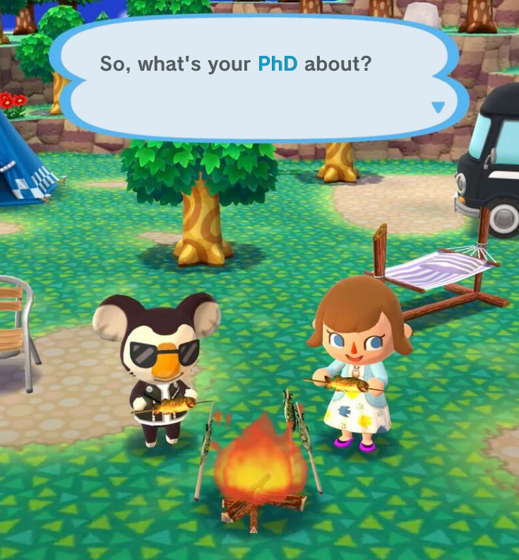
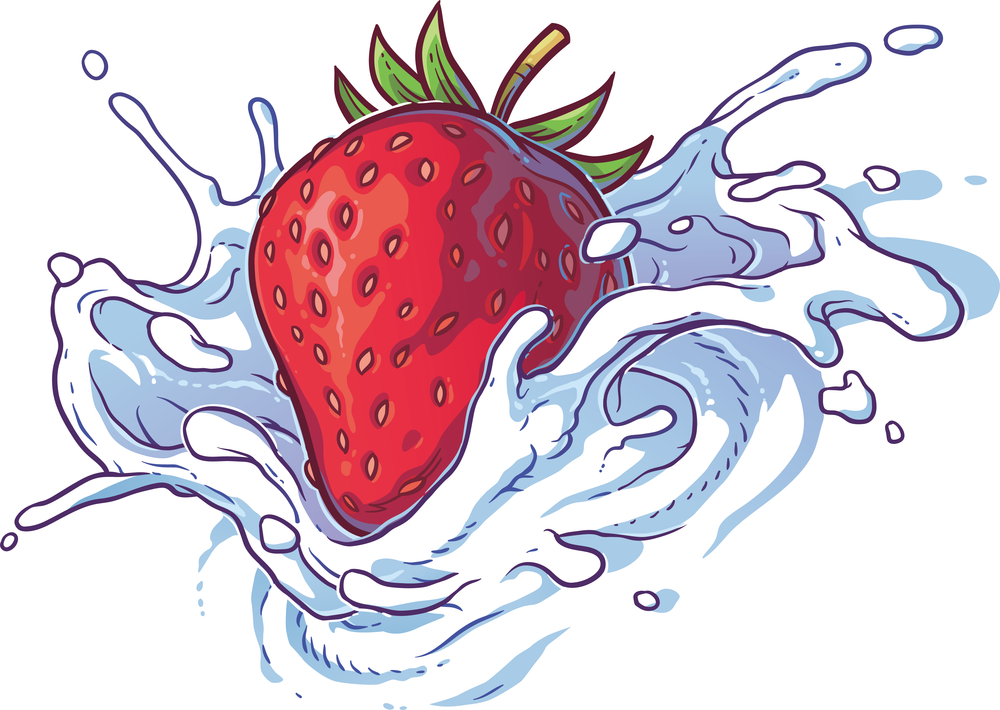
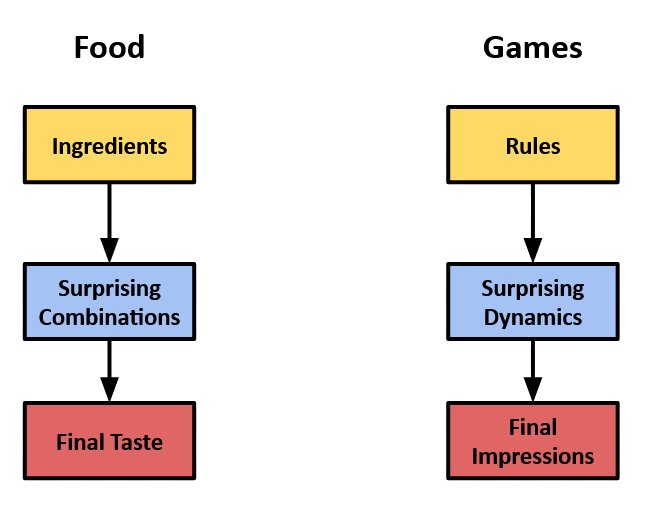
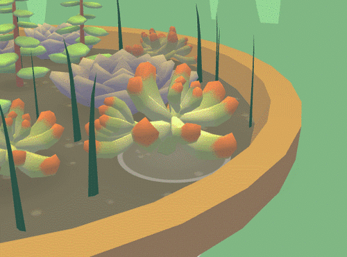

# My Jam? Planting Strawberry Seeds.

> You take a seat at the table. Everything looks delicious, you can't wait to dive in. Your aunt serves you cake. "*How is it going at school? Is it hard to be all by yourself?*", she asks. Your eyes still on your plate, your lips moves by themselves. "*It's going fine! I got my diploma last semester*". Small silence. She's still processing. You know where this is going.
"*Oh, very good! I didn't know that. So what are you doing now? Job hunting?*". You still have a couple of seconds, quick find an expl-"*Actually, I've started a PhD!*". Oh no. You went too fast. It's coming any second now. Brace yourself.
>
>
>"*Excellent! What's your research subject about?*".
>
> You take a deep breath. Here we go.

Ever since high school, I've always found it pretty difficult to explain what I'm currently studying, especially with to my family. Now that I've started a PhD at **[IGGI](https://iggi.org.uk/)** (UK), its starting to get trickier. My research subject is titled "_**Generating Coherent and Meaningful New Playable Characters**_". Its a very specific topic, at the crossroads of procedural generation, game design, and human/computer interaction.

If I wanted to explain that to my kind but over-protective aunt, I would need to start by evidencing that:
1. Playing games is actually a good thing
1. There are people who are trying to make them even better
1. We can use computers as creative assistants

Yeah. Not so easy.

But being able to communicate your work to a wide audience is a crucial skill for a researcher. After all, what good can we do to the world, if nobody understands what we're doing? That's why I'm starting this little blog: I want to be able to share all the exciting stuff I'm working on with everyone who'd like to hear a little more about games. How we make them, what they mean to us, and especially, how **games can pleasantly surprise us**.

Going back to that intro story, I believe I can  explain the core ideas behind my research in a way that is accessible, even for my gameoskeptic aunt. The answer was right under my nose, on the table. A **strawberry shortcake**.

## 1.  Playing is like Eating

At their core, playing and eating are the same thing. Hey, think about it. Everyone has their own favorite dishes, and also their favorite own game genres. We consume both food and games as a way to comfort ourselves, to relieve stress or just to have a good time.

When you look closely, a Ramadan family dinner or a Dungeon & Dragons afternoon are both excuses to create a context where we can have fulfilling social relationships.

In the end, whether it is by playing or  by eating, you're consuming **a good that someone had made with work and care**. They spent time to create an experience, hoping you'll love its taste. How did they do that?

## 2.  Game Design is like Cooking

  

Making meals and making games are both crafts that requires you to spend time mastering them. It is very easy when you're a beginner to try making complex productions, only to be disappointed in the result. But like all craft, cooking and game design require you to be patient, to learn things step by step, and to fail a lot.

The reason behind that is that fundamentally, they are **complex alchemies**: you gather ingredients and their properties combine in a way that can **create an explosion of flavors**. These kind of alchemies are not easy to master, because of their main feature

### Surprising combinations

  

  If you make a cup of strawberries and cream, you might already have a very good idea of how it will taste. But what about **white chocolate and caviar**? Would it taste good?

  Well surprisingly, the answer seem to be: Yes. They go together well enough to be used by a [ surprised but delighted chef](https://www.theguardian.com/lifeandstyle/2002/may/04/foodanddrink.shopping). Something about the caviar's salt complementing the sweetness of the chocolate. You couldn't really know that without testing it.

  Surprising combinations are at the heart of cooking. We've had about the same ingredients for centuries, but we're still able to mix them in order to create a totally new taste, that is completely different from each ingredient individually.

   

   Designing games works exactly like that. To simplify, let's say that the ingredients game designer use are the rules of the game. Their whole job is to find a way to combine rules that will create interesting dynamics in which to engage players — with the ultimate goal of leaving a pleasant impression on them.

To sum up, both game design and cooking are complex alchemies because of the way they have to use their ingredients. Both of them also require you to always try new combinations in order to progress.

But where can you get ingredients? Where do these strawberries come from?

## 3. Procedural Generation is like Planting

"*At the farmer's market, duh!*" Great cooks have the skill to carefully choose their ingredients and to assess their quality. In the game world, designers too are always on the lookout for interesting ideas that they can use as ingredients for their games.

But where do these ingredients *actually* come from?
Cooks rarely grow their own food — it's someone else's job. However, game designers don't have this commodity. Their work is not only to think about the composition of their rule-ingredients, they also have to create them from scratch each time! They have **both the job of a gardener and a cook**.

A bit unfair, right?

This the part where I come in! The goal of my PhD is to use computers to **create gardening tools for  game designers** to help them grow their ingredients. If game designers are making strawberry cake, I want to **plant strawberry seeds**.

This whole field of research is named _Procedural Generation_ and raises a lot of interesting questions. What kind of experiences will we able to make with access to new ingredients? How can computers actually grow things that are useful to humans?

I'll do my best to share my findings with you, so keep an eye on **[Strawberry Seeds](http://strawberryseeds.github.io)** !

Younès Rabii - Contact (Twitter, Mail)

#### Picture Credits

1. Animal Crossing: Original by Shelby Brown/CNET. Modified by Younès Rabii.

1. 3. [Strawberry Shortcake](https://www.pngegg.com/en/png-brbho/download)

1. (Modded) Witcher 3: Screenshot by u/Outspokenbeef15 on Reddit.

1. [Strawberry Cream](https://www.pngegg.com/en/png-brbho/download)

1. Viridi - Ice Water Games

Note:
- Context: blog work-in progress
- Theme CSS?
- Image check (dimension)
- Credits
- Fin: expliquer pourquoi Strawberry seeds, ou juste réserver ça pour l'article étendu / une section à propos ? "I made this blogpost comparing Making games to cooking and I believe this analogy is powerful"
